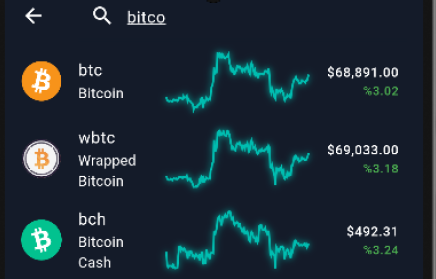
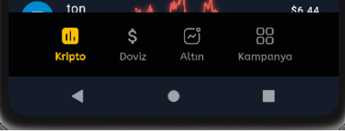
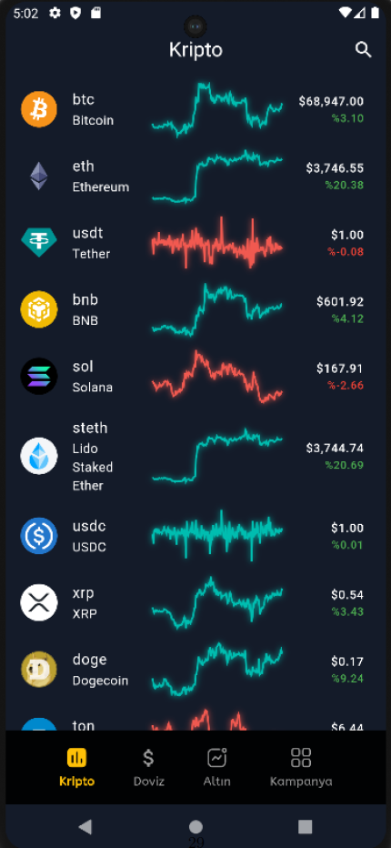
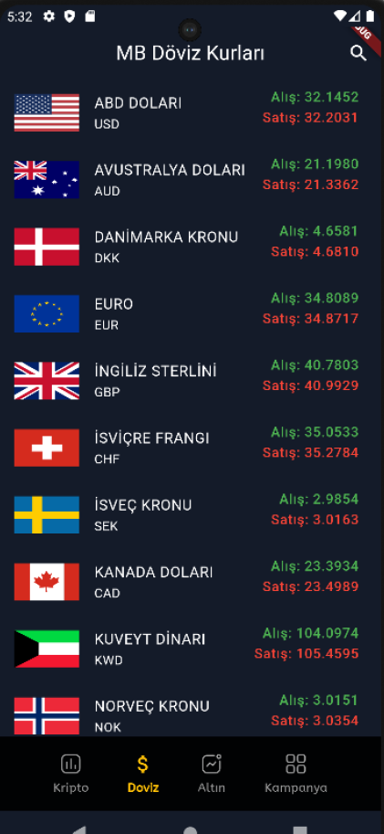
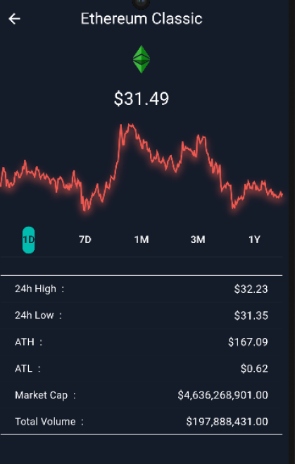

# CryptoCurrency

- CryptoCurrency App.

# Features

- Get all coins data.
- Search any coin.
- View 1d,7d,1m,3m and 1 year historical data.

# Tech

- State Management : [BLoC](https://pub.dev/packages/flutter_bloc)
- Charts : [FL Chart](https://pub.dev/packages/fl_chart)
- API : [CoinGecko](https://www.coingecko.com/tr/api/documentation)
- [MERKER BANKASI]https://www.tcmb.gov.tr/kurlar/today.xml
- [GENEL PARA]https://api.genelpara.com/embed/altin.json

## Preview

<table>
  <tr align="center">
    <td></td>
    <td></td>
    <td></td>
    <td></td>
    <td></td>

  </tr>
 </table>
